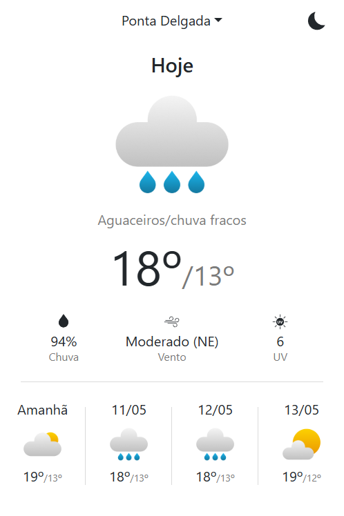

# PT Weather Extension
A **Chrome Extension** that provides up-to-date weather forecasts for Portugal, powered by the official [IPMA API](https://api.ipma.pt). Users can select a location to view a 5-day forecast, UV indexes, and active meteorological warnings.

## Usage
1. Clone Repo
```
git clone https://github.com/luis-gouveia/pt-weather-extension.git
cd pt-weather-extension
```
2. Install NPM packages
```
npm install
```
3. Build the extension
```
npm run build
```
4. Open Chrome and navigate to `chrome://extensions`
5. Enable `Developer Mode`
6. Click `Load unpacked` and select the `dist` folder inside the project directory

The extension should now appear in your browser's toolbar.

## Screenshots



## License
This project is licensed under the MIT License - see the [LICENSE](LICENSE) file for details.\
Weather data provided by [IPMA](https://api.ipma.pt/). Please refer to their site for more information.
